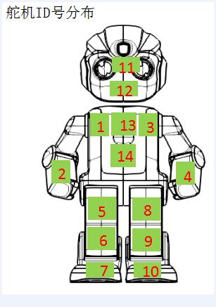

# MotorApi 类 API 文档

## 概述

  

控制服务是ROSE中一个服务应用，安装控制服务相应要安装ROSE中Master应用，master应用的安装参看[《master用户指导》](https://10.10.1.34/Rose/rosa_packages_Master/blob/master/doc/user-guide.md)。目前，在alpha系列机器人内包含一块控制板，机器人核心板通过串口连接控制板，核心板上的android应用使用一组约定的串口协议与控制板通讯，通过控制板控制舵机。控制服务的主要功能在于定义统一的控制板访问接口，包括：舵机控制，控制板升级，红外等其他杂项设置; 另外，为了让机器人执行一组复杂的动作，预置动作配置文件即ubx动作文件于机器人内，控制服务具有解析播放ubx文件功能,并对外提供接口。本文档简要说明这些接口及sdk集成。

  

## 舵机ID分布

  

* 角度范围

  

|ID号|身体部位|角度范围|初始角度|

|:--:|:---|:--:|:---|

|1|右肩膀|0-240|120|

|2|右手臂|70-170|120|

|3|左肩膀|0-240|120|

|4|左手臂|70-170|120|

|5|右大腿|20-220|120|

|6|右脚踝|20-220|120|

|7|右脚掌|70-132|120|

|8|左大腿|20-220|120|

|9|左脚踝|20-220|120|

|10|左脚掌|70-132|120|

|11|脑袋|110-130|120|

|12|下巴|110-130|120|

|13|脖子|70-170|120|

|14|腰|70-170|120|

  

* 参考图

  



---

## 方法列表

### 获取舵机信息

#### `getMotorList`
- **功能**: 获取机器人上所有舵机的信息列表。
- **方法签名**:
  ```java
  public void getMotorList(@NonNull final ResponseListener<List<Motion.Motor>> listener)
  ```

- **参数**:
  - `listener`: 回调接口，返回舵机信息列表。
- **同步版本**:
  ```java
  public @Nullable List<Motion.Motor> getMotorList()
  ```


#### `getMotor`
- **功能**: 获取指定 ID 的舵机信息。
- **方法签名**:
  ```java
  public @Nullable Motion.Motor getMotor(int id)
  ```

- **参数**:
  - `id`: 舵机 ID。

#### `getMotorSum`
- **功能**: 获取机器人上舵机的总数。
- **方法签名**:
  ```java
  public int getMotorSum()
  ```


---

### 舵机角度控制

#### `moveToAbsoluteAngle`
- **功能**: 移动单个或一组舵机到指定的绝对角度。
- **方法签名**:
  ```java
  public void moveToAbsoluteAngle(@IntRange(from = 1, to = 14) final int motorId, final int angle,
      @IntRange(from = 0, to = 5000) final int duration, ResourcePolicy policy,
      @Nullable final ResponseListener<Void> listener)
  ```

- **参数**:
  - `motorId`: 舵机 ID。
  - `angle`: 目标角度。
  - `duration`: 运行时长（毫秒）。
  - `policy`: 资源策略。
  - `listener`: 回调接口。

---

### 舵机角度读取

#### `readAbsoluteAngle`
- **功能**: 读取单个或一组舵机的当前角度。
- **方法签名**:
  ```java
  public void readAbsoluteAngle(final int motorId, boolean adcump,
      @NonNull final ResponseListener<Integer> listener)
  ```

- **参数**:
  - `motorId`: 舵机 ID。
  - `adcump`: 是否掉电读取。
  - `listener`: 回调接口。

#### `readOffsetAngle`
- **功能**: 读取单个或一组舵机的调整角度。
- **方法签名**:
  ```java
  public void readOffsetAngle(final int motorId,
      @NonNull final ResponseListener<Integer> listener)
  ```


---

### 舵机校准

#### `setOffsetAngle`
- **功能**: 设置单个或一组舵机的校准角度。
- **方法签名**:
  ```java
  public boolean setOffsetAngle(final int motorId, final int offsetAngle)
  ```

- **参数**:
  - `motorId`: 舵机 ID。
  - `offsetAngle`: 校准角度。

#### `setBasicAngle`
- **功能**: 设置单个或一组舵机的基准角度。
- **方法签名**:
  ```java
  public boolean setBasicAngle(final int motorId, final int BasicAngle, final ServoSener servoSener)
  ```


---

### 舵机状态控制

#### `lockMotor`
- **功能**: 锁紧单个或一组舵机。
- **方法签名**:
  ```java
  public void lockMotor(final int motorId, @Nullable final ResponseListener<Boolean> listener)
  ```


#### `unlockMotor`
- **功能**: 松弛单个或一组舵机。
- **方法签名**:
  ```java
  public void unlockMotor(final int motorId, @Nullable final ResponseListener<Boolean> listener)
  ```


---

### 舵机状态检查

#### `checkServoStatus`
- **功能**: 检查单个或一组舵机是否正常工作。
- **方法签名**:
  ```java
  public boolean checkServoStatus(final int motorId)
  ```


---

### 其他功能

#### `clearProtectFlag`
- **功能**: 清除舵机保护位。
- **方法签名**:
  ```java
  public boolean clearProtectFlag(@NonNull List<Integer> motorIds)
  ```


#### `reset`
- **功能**: 舵机复位。
- **方法签名**:
  ```java
  public void reset(ResourcePolicy policy, @Nullable final ResponseListener<Boolean> listener)
  ```


#### `powerOn` / `powerOff`
- **功能**: 打开或关闭舵机电源。
- **方法签名**:
  ```java
  public void powerOn()
  public void powerOff()
  ```


#### `isPowerOn`
- **功能**: 判断舵机电源是否开启。
- **方法签名**:
  ```java
  public boolean isPowerOn()
  ```


---

### 订阅事件

#### `subscribeMotorErrorEvent`
- **功能**: 订阅舵机硬件异常事件。
- **方法签名**:
  ```java
  public void subscribeMotorErrorEvent(MotorErrorReceiver receiver)
  ```


#### `subscribeMotorStatusEvent`
- **功能**: 订阅舵机状态事件。
- **方法签名**:
  ```java
  public void subscribeMotorStatusEvent(MotorStatusReceiver receiver)
  ```


#### `unsubscribeMotorErrorEvent` / `unsubscribeMotorStatusEvent`
- **功能**: 取消订阅舵机事件。
- **方法签名**:
  ```java
  public void unsubscribeMotorErrorEvent(MotorErrorReceiver receiver)
  public void unsubscribeMotorStatusEvent(MotorStatusReceiver receiver)
  ```


---
根据提供的 `SysApi.java` 文件中的注释，以下是生成的 API 文档：

---


## SysApi 类文档
该 API 提供一些系统级的接口，如读取序列号、读取软件版本、关机、读取舵机是否掉电等。

---

## 方法列表

### 1. `readCtrlVersion(ResponseListener<String> listener)` *(已废弃)*
**描述**: 异步读取胸板软件版本。  
**参数**:  
- `listener`: 回调接口，用于返回版本号或错误信息。  

---

### 2. `readCtrlVersion()` *(已废弃)*
**描述**: 同步读取胸板软件版本。  
**返回值**:  
- 返回胸板软件版本号。如果无法读取，则返回空字符串。

---

### 3. `readAppVersion()` *(已废弃)*
**描述**: 同步读取胸板 App 软件版本。  
**返回值**:  
- 返回胸板 App 软件版本号。如果无法读取，则返回空字符串。

---

### 4. `readMcuVersion(int mode)`
**描述**: 读取 MCU 软件版本。  
**参数**:  
- `mode`: 模式参数，0 表示 Boot 版本，1 表示 APP 版本。  

**返回值**:  
- 返回 MCU 软件版本号。如果无法读取，则返回空字符串。

---

### 5. `shutdown()`
**描述**: 关闭胸口板系统。  
**逻辑**:  
- 调用 `/shutdown` 接口关闭系统，并记录日志。

---

### 6. `setPowerSaveMode(boolean isOn, ResponseListener<Void> listener)`
**描述**: 设置舵机省电模式。  
**参数**:  
- `isOn`: 是否开启省电模式，`true` 表示开启，`false` 表示关闭。  
- `listener`: 回调接口，用于返回设置结果或错误信息。  

---

### 7. `isMotorPowerOn(ResponseListener<Void> listener)`
**描述**: 判断舵机是否上电。  
**参数**:  
- `listener`: 回调接口，用于返回判断结果或错误信息。  

**返回值**:  
- 返回布尔值，表示舵机是否上电。
---

### 8. `subscribeSubsystemErrorEvent(SubsystemErrorReceiver receiver)`
**描述**: 订阅子系统错误事件。  
**参数**:  
- `receiver`: 监听器，用于接收子系统错误事件。

---

### 9. `unsubscribeSubsystemErrorEvent(SubsystemErrorReceiver receiver)`
**描述**: 取消订阅子系统错误事件。  
**参数**:  
- `receiver`: 监听器，用于取消订阅。

---

## 静态方法

### `get()`
**描述**: 获取 `SysApi` 的单例实例。  
**返回值**:  
- 返回 `SysApi` 的单例对象。

---

## 内部实现细节

### 私有方法
#### `getContext()`
**描述**: 获取当前应用的上下文。  
**逻辑**:  
- 如果上下文为空，则通过反射调用 `ActivityThread.currentApplication()` 方法获取。

---

### 单例模式
- 使用静态内部类 `Holder` 实现线程安全的单例模式。

---
根据提供的 `ActionApi.java` 文件中的注释，以下是生成的 API 文档：

---


## ActionApi 类文档
该 API 用于执行指定动作，包含的功能有关动作的播放、停止、获取动作列表、获取动作详情、获取动作状态（播放中、停止等）。  
动作文件保存在 `/odm/wk_res/actions` 目录下。

---

## 方法列表

### 1. `getActionList(ResponseListener<List<Motion.Action>> listener)`
**描述**: 异步获取机器人支持的动作文件列表。  
**参数**:  
- `listener`: 回调接口，用于返回动作列表或错误信息。

---

### 2. `getActionList()`
**描述**: 同步获取机器人支持的动作文件列表。  
**返回值**:  
- 返回 `Motion.Action` 的列表。如果无法读取，则返回空列表。

---

### 3. `getCustomizeActionList()`
**描述**: 获取机器人内置到 SD 卡的自定义动作文件列表。  
**返回值**:  
- 返回 `Motion.Action` 的列表。如果无法读取，则返回空列表。

---

### 6. `playAction(String action, ResponseListener<Void> listener)`
**描述**: 播放一个动作，默认优先级为 0。  
**参数**:  
- `action`: 动作名称。  
- `listener`: 回调接口，用于返回播放结果或错误信息。

---

### 7. `playAction(String action, ResourcePolicy policy, ResponseListener<Void> listener)`
**描述**: 播放一个动作，并指定资源策略。  
**参数**:  
- `action`: 动作名称。  
- `policy`: 资源策略。  
- `listener`: 回调接口，用于返回播放结果或错误信息。

---

### 8. `playCustomizeAction(String actionId, ResponseListener<Void> listener)`
**描述**: 播放一个内置到 SD 卡中的自定义动作，默认优先级为 0。  
**参数**:  
- `actionId`: 动作 ID。  
- `listener`: 回调接口，用于返回播放结果或错误信息。

---

### 9. `playCustomizeAction(String actionId, ResourcePolicy policy, ResponseListener<Void> listener)`
**描述**: 播放一个内置到 SD 卡中的自定义动作，并指定资源策略。  
**参数**:  
- `actionId`: 动作 ID。  
- `policy`: 资源策略。  
- `listener`: 回调接口，用于返回播放结果或错误信息。

---

### 10. `stopAction(ResponseListener<Void> listener)`
**描述**: 异步停止当前播放的动作。  
**参数**:  
- `listener`: 回调接口，用于返回停止结果或错误信息。

---

### 11. `stopAction()`
**描述**: 同步停止当前播放的动作。  
**返回值**:  
- 返回布尔值，表示是否成功停止。

---

### 12. `stopActionByName(String name)`
**描述**: 停止系统内置的指定名称的动作。  
**参数**:  
- `name`: 动作名称。

---

### 13. `stopCustomizeActionByName(String name)`
**描述**: 停止自定义的指定名称的动作。  
**参数**:  
- `name`: 动作名称。

---

### 14. `isPlaying(ResponseListener<Boolean> listener)`
**描述**: 异步判断机器人是否正在做动作。  
**参数**:  
- `listener`: 回调接口，用于返回判断结果或错误信息。

---

### 15. `isPlaying()`
**描述**: 同步判断机器人是否正在做动作。  
**返回值**:  
- 返回布尔值，表示机器人是否正在做动作。

---

### 16. `unsafeAction(String actionId)`
**描述**: 判断动作是否为高位动作。  
**参数**:  
- `actionId`: 动作 ID。  

**返回值**:  
- 返回布尔值，表示动作是否为高位动作。

---

### 17. `currentAction()`
**描述**: 获取当前正在执行的动作信息。  
**返回值**:  
- 返回 `Motion.Action` 的列表。如果当前没有执行动作，则返回 `null`。

---

### 18. `subscribeEvent(ActionStoppedReceiver receiver)`
**描述**: 订阅动作停止事件。  
**参数**:  
- `receiver`: 状态监听器。

---

### 19. `unsubscribeEvent(EventReceiver receiver)`
**描述**: 取消订阅动作停止事件。  
**参数**:  
- `receiver`: 状态监听器。

---

## 静态方法

### `get()`
**描述**: 获取 `ActionApi` 的单例实例。  
**返回值**:  
- 返回 `ActionApi` 的单例对象。

---

## 内部实现细节

### 私有方法
#### `getContext()`
**描述**: 获取当前应用的上下文。  
**逻辑**:  
- 如果上下文为空，则通过反射调用 `ActivityThread.currentApplication()` 方法获取。

---

### 竞争会话创建
- 使用 `createCompetitionSession` 和 `createCompetitionSession2` 创建竞争会话，用于管理动作播放时的资源竞争。

---

### 注意事项
1. 部分方法需要传入回调接口以处理异步操作。
2. 同步方法可能抛出异常，调用时需注意捕获。
3. 动作文件存储路径为 `/odm/wk_res/actions`，确保文件存在且可访问。

---


## StandUpApi 类文档
该 API 用于机器人的姿态获取（站立、蹲下、卧倒等）。除了读取姿态外，该 API 还提供了几个姿态控制函数，如 `standUp`、`squatdown`、`resetIsNotHead`（站立姿态，并且解锁上半身舵机）等。

---

## 方法列表

### 1. `getRobotGesture()`
**描述**: 获取机器人当前的姿态。  
**返回值**:  
- 返回 `RobotGestures.GestureType` 枚举值，表示机器人的当前姿态。如果发生异常，则返回 `null`。

---

### 2. `standUp(ResponseCallback listener)`
**描述**: 控制机器人从复杂姿态站起。  
**参数**:  
- `listener`: 回调接口，用于返回操作结果或错误信息。

---

### 3. `squatdown(ResponseCallback callback)`
**描述**: 控制机器人蹲下。  
**参数**:  
- `callback`: 回调接口，用于返回操作结果或错误信息。

---

### 4. `standUpForSkill(ResponseCallback callback)`
**描述**: 通过技能让机器人站起。  
**参数**:  
- `callback`: 回调接口，用于返回操作结果或错误信息。  

**备注**:  
- 该方法实际调用的是 `standUp` 方法。

---

### 5. `resetIsNotHead(ResponseCallback callback)`
**描述**: 除头部舵机外，所有舵机复位。  
**参数**:  
- `callback`: 回调接口，用于返回操作结果或错误信息。

---

## 静态方法

### `getInstance()`
**描述**: 获取 `StandUpApi` 的单例实例。  
**返回值**:  
- 返回 `StandUpApi` 的单例对象。

---

## 内部实现细节

### 私有方法

#### `callService(String action, ResponseCallback listener)`
**描述**: 调用服务接口执行指定动作。  
**逻辑**:  
- 创建竞争会话并设置资源策略为独占模式。
- 调用指定的动作接口，并在完成后释放资源。

---

#### `getContext()`
**描述**: 获取当前应用的上下文。  
**逻辑**:  
- 如果上下文为空，则通过反射调用 `ActivityThread.currentApplication()` 方法获取。

---

#### `createCompetitionSession()`
**描述**: 创建竞争会话，用于管理动作播放时的资源竞争。  
**逻辑**:  
- 遍历 1 到 14 号电机，创建对应的竞争项列表。
- 返回包含所有竞争项的竞争会话。

---
